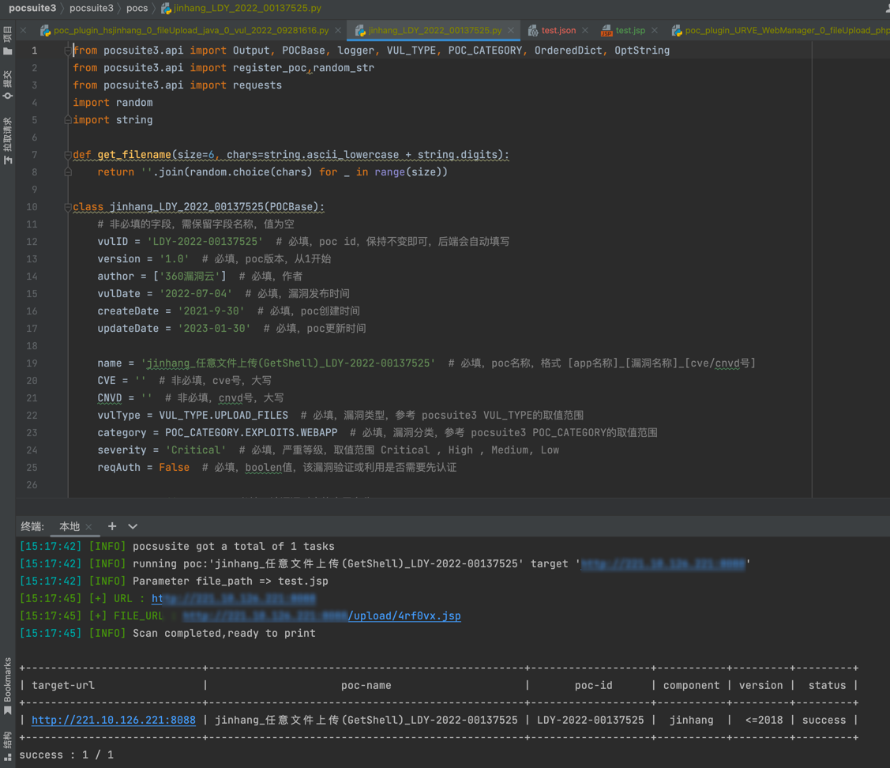

# exp_code_generator
pocsuite3-exp-生成器
```
CLASSNAME = 'jinhang_LDY_2022_00137525'
VUL_ID = 'LDY-2022-00137525'
VUL_DATE = '2022-07-04'
CREATEDATE = '2021-9-30'
UPDATEDATE = '2023-01-30'
APP_NAME = 'jinhang'
VUL_NAME = '任意文件上传(GetShell)' #漏洞名称
VUL_NUM  = 'LDY-2022-00137525' #漏洞编号
CVE_NUM = '' #CVE编号
CNVD_NUM = '' #CNVD编号
VUL_TYPE = 'UPLOAD_FILES' # 必填，漏洞类型，参考 pocsuite3 VUL_TYPE的取值范围
POC_CATEGORY = 'EXPLOITS.WEBAPP' # 必填，漏洞分类，参考 pocsuite3 POC_CATEGORY的取值范围
SEVERITY = 'Critical' # 必填，严重等级，取值范围 Critical , High , Medium, Low
REQAUTH = 'False' # 必填，boolen值，该漏洞验证或利用是否需要先认证
FINGERPRINT_NAMES = 'jinhang' # 必填，当命中哪些指纹后，可使用该poc。列表中是指纹的名称
APP_MAIN_PORT = '80' # 必填，该应用的默认配置端口，用于快速扫描模式，若无法确认可以写80
APPVERSION = '<=2018' # 必填，漏洞影响的版本号
APP_POWER_LINK = 'http://www.hsjinhang.com/' # 非必填，应用厂商链接
DESC = '金航网上阅卷系统可以提供以学生、班级、学校、年级、教师、科目、知识点等为测量依据的各种成绩分析报表，并能提供每个学生历次考试结果的综合分析。金航网上阅卷系统存在文件上传漏洞，攻击者可利用该漏洞获取系统权限'
SUGGEST = '厂商尚未提供漏洞修补方案，请关注厂商主页及时更新：http://www.hsjinhang.com/'
HASEXP = 'True' # 必填，boolen值，是否包含exp
TARGETS = 'http://yj.ybwsxx.com.cn:8011' # 必填，该Poc适用的目标，string类型
SURICATA_RULES = 'fileUpload' # 必填，suricata格式的检测规则,这里只需要填写匹配流量包关键词即可
COMMAND = '#'
FILE_PATH = '' #如果不使用file_path=传shell地址，可以使用"#"进行传参数
REFERENCES = '' # 非必填，漏洞相关参考链接
URI = '/fileUpload' #payload请求uri
PAYLOAD_DATA = {'upload': (filename,param,"image/png")} #传入的data数据
UPLOAD_DIRECTORY = '/upload/'
FILE_SUFFIX = 'jsp'
TIMEOUT = 3
METHOD = 'post' # request 请求方式 get、post
HEADERS = "None"
ATTACK_PAYLOAD_DATA = '11'
ATTACK_URI = "" #利用payload请求uri
```

#### 生成之后的代码



### 目前文件目录如下

```
├── LICENSE
├── README.md
├── conf
│   └── server.json
├── conventer
│   ├── inside_conventer.json
│   └── public_conventer.json
├── envs
│   ├── inside.env
│   └── public.env
├── img.png
├── main.py
├── pocs
│   └── Apache_Flink_360_202106_443814.py
├── requirements.txt
└── templates
    ├── pocsuite3_code_bak_01.template
    ├── pocsuite3_code_rce_with_echo_back.template
    ├── pocsuite3_code_rce_without_echo_back.template
    └── pocsuite3_code_upload_files.template

```

### 食用方法

1. 先装库

2. 配置server.json漏洞信息获取配置，样例如下

   ```json
   [
     {
     	//服务器名称
       "name": "360对外POC收录平台",
       //服务器查询url，可通过CVE等漏洞编号获取到在服务器中存储的ID
       "searchURL": "http://vulsub.xyz/api/admin/vul/basic_info_list",
       //查询格式，用{VULID}代替实际内容
       "searchData": {
         "vul_num:": "{VULID}"
       },
       //查询后返回的json数据中的id的字典获取表示
       "paramPosition": "['data']['list'][0]['id']",
       //查询方法，默认json
       "searchMethod": "GET",
       //通过漏洞在数据库中ID获取漏洞完整信息的URL
       "informationURL": "http://vulsub.xyz/api/admin/vul/get_all_vul_list",
       //获取信息的查询格式，用{PARAM}代替漏洞在数据库中的ID
       "informationData": {
         "id": "{PARAM}"
       },
       //查询方法，默认json
       "informationMethod": "JSON",
       //查询出的数据的相对位置
       "detailPosition": "['data']['data']",
       "cookie": {},
       "header": {
         "Accept": "application/json, text/plain, */*",
         "Accept-Encoding": "gzip, deflate",
         "Accept-Language": "zh-CN,zh;q=0.9,en;q=0.8,en-GB;q=0.7,en-US;q=0.6",
         "Authorization": "",
         "Content-Type": "application/json",
         "Host": "vulsub.xyz",
         "Origin": "http://47.243.15.16",
         "Proxy-Connection": "keep-alive",
         "Referer": "http://47.243.15.16/",
         "User-Agent": "Mozilla/5.0 (Macintosh; Intel Mac OS X 10_15_7) AppleWebKit/537.36 (KHTML, like Gecko) Chrome/109.0.0.0 Safari/537.36 Edg/109.0.1518.78"
       },
       //使用的转换器json，后面会讲
       "conventer": "public_conventer.json"
     }
   ]
   ```

   服务器list为列表格式，对于信息优先级，在后面的服务器数据>在前面的服务器数据>env文件中的数据

3. 配置conventer将数据库中的数据转换为本地变量

   ```json
   {
     "vul_num": "['vul_num']",
     "vul_id": "['id']",
     "app_name": "['get_vu_sub']['product_name']",
     "cve_num": "['get_vu_sub']['cve_num']",
     "cnvd_num": "['get_vu_sub']['cnvd_num']",
     "appVersion": "['get_vu_sub']['affect_ver']",
     "reqAuth": "['auth_type']",
     "appPowerLink": "['get_vu_sub']['store_website']",
     "desc": "['bug_desc']",
     "suggest": "['get_vu_sub']['temp_plan']",
     "suricata_rules": "['suricata_rule']",
     "create_date": "['get_vu_sub']['ver_open_date']",
     "update_date": "['get_vu_sub']['updated_at']",
     "vul_date": "['get_vu_sub']['created_at']",
     "vul_type": "['get_vu_sub']['vul_type']",
     "vul_name": "['get_vu_sub']['name']",
     "severity": "['get_vu_sub']['vul_level']"
   }
   ```

   配置时键为本地变量名，值为获取到的结果总中相对内容的python字典表达

4. 配置env文件

   ```
   CLASSNAME = 'jinhang_LDY_2022_00137525'
   VUL_ID = 'LDY-2022-00137525'
   VUL_DATE = '2022-07-04'
   CREATEDATE = '2021-9-30'
   UPDATEDATE = '2023-01-30'
   APP_NAME = 'jinhang'
   VUL_NAME = '任意文件上传(GetShell)' #漏洞名称
   VUL_NUM  = 'LDY-2022-00137525' #漏洞编号
   CVE_NUM = '' #CVE编号
   CNVD_NUM = '' #CNVD编号
   VUL_TYPE = 'UPLOAD_FILES' # 必填，漏洞类型，参考 pocsuite3 VUL_TYPE的取值范围
   POC_CATEGORY = 'EXPLOITS.WEBAPP' # 必填，漏洞分类，参考 pocsuite3 POC_CATEGORY的取值范围
   SEVERITY = 'Critical' # 必填，严重等级，取值范围 Critical , High , Medium, Low
   REQAUTH = 'False' # 必填，boolen值，该漏洞验证或利用是否需要先认证
   FINGERPRINT_NAMES = 'jinhang' # 必填，当命中哪些指纹后，可使用该poc。列表中是指纹的名称
   APP_MAIN_PORT = '80' # 必填，该应用的默认配置端口，用于快速扫描模式，若无法确认可以写80
   APPVERSION = '<=2018' # 必填，漏洞影响的版本号
   APP_POWER_LINK = 'http://www.hsjinhang.com/' # 非必填，应用厂商链接
   DESC = '金航网上阅卷系统可以提供以学生、班级、学校、年级、教师、科目、知识点等为测量依据的各种成绩分析报表，并能提供每个学生历次考试结果的综合分析。金航网上阅卷系统存在文件上传漏洞，攻击者可利用该漏洞获取系统权限'
   SUGGEST = '厂商尚未提供漏洞修补方案，请关注厂商主页及时更新：http://www.hsjinhang.com/'
   HASEXP = 'True' # 必填，boolen值，是否包含exp
   TARGETS = 'http://yj.ybwsxx.com.cn:8011' # 必填，该Poc适用的目标，string类型
   SURICATA_RULES = 'fileUpload' # 必填，suricata格式的检测规则,这里只需要填写匹配流量包关键词即可
   COMMAND = '#'
   FILE_PATH = '' #如果不使用file_path=传shell地址，可以使用"#"进行传参数
   REFERENCES = '' # 非必填，漏洞相关参考链接
   URI = '/fileUpload' #payload请求uri
   PAYLOAD_DATA = {'upload': (filename,param,"image/png")} #传入的data数据
   UPLOAD_DIRECTORY = '/upload/'
   FILE_SUFFIX = 'jsp'
   TIMEOUT = 3
   METHOD = 'post' # request 请求方式 get、post
   HEADERS = "None"
   ATTACK_PAYLOAD_DATA = '11'
   ATTACK_URI = "" #利用payload请求uri
   TEMPLATE="pocsuite3_code_rce_without_echo_back.template"#生成利用的模版文件
   ```

   上面为一个完整的env配置，其中必填项为VUL_ID和TEMPLATE，分别为在使用过程中需要查询的漏洞编号，和生成exp文件需要的漏洞类型模版

5. 在main.py文件中配置需要使用的env文件，运行main.py即可

### 已知问题

1. 目前仅配置了post，get，json三种查询操作，需要其他http请求方法可自行重构

2. 模版文件可自行重构，对于模版中不存在的变量会自动忽略，无需特意在main方法中删除

3. 由于Jlan代码能力不佳，目前对于参数覆盖的解决方案是将所有的变量都转换为全局变量，代码实现并不优雅，可尝试重构

   


